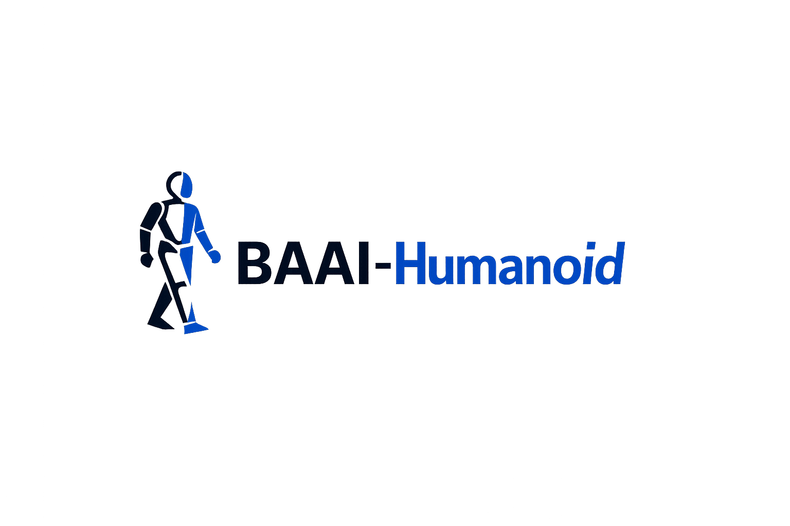

# BAAI-Humanoid

  

We build **whole-body mobile manipulation** for humanoid robots — enabling robust real-world behaviors that tightly couple **locomotion**, **whole-body control**, and **contact-rich manipulation**.

Our long-term goal is to develop learning-based systems that can **move, reach, interact, and recover** in complex environments, with reliable **sim-to-real transfer** and scalable **data + training pipelines**.

## Research Themes

- **Whole-body mobile manipulation**
  - Coordinated locomotion + manipulation
  - Long-horizon stability and task-centric control

- **Contact-rich whole-body control**
  - Balancing, recovery, pushes/perturbations, and physical interaction
  - Safety-aware control and robust execution

- **Dexterous manipulation**
  - Bimanual skills and fine-grained control
  - Multimodal policies (vision / touch / proprioception)

- **Teleoperation & data**
  - Human demonstration capture and scalable dataset curation
  - Retargeting and cross-interface motion tracking

- **Sim-to-real deployment**
  - Domain adaptation / residual learning / system identification
  - Reproducible training, evaluation, and deployment toolchains
